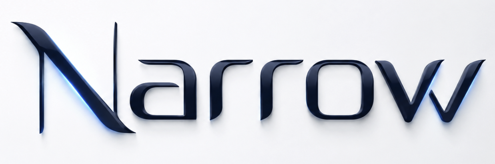

# Narrow

[中文说明](README.zh-CN.md) · [Project guide](docs/PROJECT_GUIDE.md) · [Contributing](CONTRIBUTING.md)

[](https://github.com/eddy-Wang/Narrow/actions/workflows/ci.yml)
[](https://github.com/eddy-Wang/Narrow/releases/latest)
[](LICENSE)
[](https://www.python.org/)

Narrow is an open-source conversational product-search engine for applications
that need to preserve user intent across multiple turns. It combines the
OpenAI Responses API with stateful query understanding, adaptive multi-route
retrieval, constraint-aware filtering, and learning-to-rank.

Instead of treating every message as a new search, Narrow maintains a canonical
intent state. A user can add a budget, replace a preferred brand, retract an
earlier requirement, or answer a clarification question without losing the
rest of the conversation.

<p align="center">
  
</p>

## Why Narrow

- **State that drives execution.** Validated state patches update active,
  superseded, and no-preference slots before the next search.
- **Adaptive retrieval.** Buying, browsing, and uncertain requests receive
  different lexical, dense, and attribute-route weights and candidate depths.
- **Constraint-aware ranking.** Hard requirements, soft preferences, unknown
  attributes, and candidate backfill are handled separately.
- **Useful clarification.** Information gain and model evidence determine
  whether the agent should recommend or ask one focused question.
- **Inspectability.** Turn-level traces expose state changes, retrieval routes,
  constraints, candidates, and final ranking decisions.
- **Reproducible evaluation.** The repository includes offline tests, a scenario
  simulator, ranking metrics, and trace-based failure analysis.

## Architecture

```text
User message + profile
        │
        ▼
OpenAI Responses API ──► validated StatePatch ──► canonical intent state
                                                      │
                                                      ▼
                                    adaptive retrieval policy
                                   ┌────────┬────────┬──────────┐
                                   │ lexical│ dense  │ attribute│
                                   └────────┴────────┴──────────┘
                                                      │
                                                      ▼
                             weighted fusion → constraints → LambdaMART
                                                      │
                                                      ▼
                               recommend or clarify → next state update
```

The OpenAI path uses the Responses API and JSON Schema Structured Outputs for
intent updates and dialogue decisions. Retrieval and ranking remain local, so
the model is used for language understanding and decision policy rather than as
a product database.

## Quickstart

Requirements: Python 3.12, [uv](https://docs.astral.sh/uv/), and an OpenAI API key.

```bash
git clone https://github.com/eddy-Wang/Narrow.git
cd Narrow
uv sync --locked --project narrow-shopping-agent \
  --extra web --extra ltr --extra openai --group dev
cp narrow-shopping-agent/.env.example narrow-shopping-agent/.env
```

Edit `narrow-shopping-agent/.env`:

```dotenv
OPENAI_API_KEY=your_api_key
OPENAI_MODEL=gpt-5.5
OPENAI_REASONING_EFFORT=low
SHOPPING_LLM_PROVIDER=openai
SHOPPING_AGENT_ENABLE_LLM=true
SHOPPING_DENSE_BACKEND=local
LANGSMITH_TRACING=false
```

API keys stay server-side. Never commit `.env`.

## Add a product catalog

Place a JSONL catalog at `narrow-shopping-agent/data/catalog.jsonl`. Each row
needs a stable `parent_asin` and searchable product text; structured attributes
such as category, price, brand, color, and size improve filtering and ranking.
See the [data guide](narrow-shopping-agent/data/README.md) for the accepted
schema and attribution requirements.

The repository does not redistribute a production catalog. You are responsible
for ensuring that your data source and use comply with its license and terms.

## Run the agent

```bash
cd narrow-shopping-agent
uv run --extra web --extra ltr --extra openai python -m shopping_agent.web
```

Or use the Python interface:

```python
from dotenv import load_dotenv
from agent import Agent
from shopping_agent.ranking.lambdamart import LambdaMARTReranker

load_dotenv(".env")
agent = Agent(
    catalog_path="data/catalog.jsonl",
    reranker=LambdaMARTReranker("models/lambdamart_synthetic_2000"),
)

session_id = agent.start_session(user_profile={"locale": "en"})
result = agent.chat(session_id, "I need waterproof walking shoes under $100.")
print(result["message"])
print(result["recommendations"])
```

## Run the workbench

From the repository root:

```bash
npm --prefix demo-frontend ci --no-audit --no-fund
npm --prefix trace-visualizer ci --no-audit --no-fund
./scripts/run_demo.sh --skip-install
```

- Shopping workbench: `http://127.0.0.1:5173`
- Agent API: `http://127.0.0.1:8000`
- Trace viewer: `http://127.0.0.1:3000`

## Testing

```bash
uv run --project narrow-shopping-agent --group dev pytest -q
npm --prefix demo-frontend test -- --run
node --experimental-strip-types --test \
  trace-visualizer/scripts/tests/trace-format.test.mjs
```

Online tests are opt-in and require `OPENAI_API_KEY`. Unit and regression tests
use deterministic fakes and do not spend API credits.

## Repository map

| Path | Purpose |
|---|---|
| `narrow-shopping-agent/` | Stateful agent, retrieval, ranking, API, tests, and model bundle |
| `demo-frontend/` | Browser workbench for chat, settings, evaluation, and run inspection |
| `trace-visualizer/` | Portable viewer for turn-level state and ranking traces |
| `user-simulator/` | Reproducible conversational scenarios and aggregate metrics |
| `docs/` | Project guide, testing, and trace-format documentation |

## Open-source maintenance

Narrow welcomes issue reports, evaluation scenarios, retrieval backends,
ranking improvements, documentation fixes, and reproducible benchmarks. See
[CONTRIBUTING.md](CONTRIBUTING.md) for the development workflow and
[SECURITY.md](SECURITY.md) for responsible vulnerability reporting, and
[ROADMAP.md](ROADMAP.md) for planned work.

## License

Code in this repository is available under the [MIT License](LICENSE). Model
weights and external datasets may have separate provenance or usage terms; see
the adjacent attribution files before redistribution.
